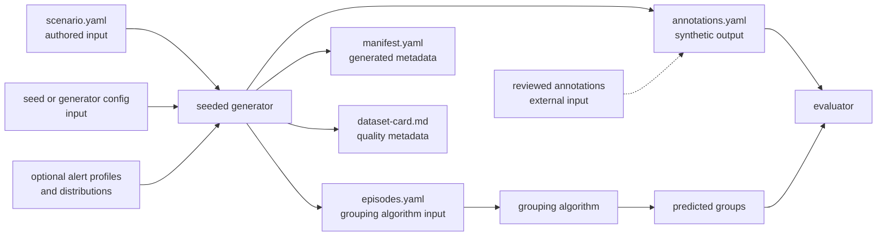

# Synthetic Benchmark Dataset Generator

**Status:** Draft v0.1

## 1. Purpose

This document defines the design for a generator of synthetic alert datasets used to benchmark incident grouping algorithms.

The generator should produce alert episodes with:

- known reference incident assignments;
- realistic temporal relationships and randomness;
- valid Prometheus/OpenShift-style labels;
- reproducible output controlled by a seed;
- enough variation to expose over-grouping and under-grouping.

The generator is not an implementation yet. It defines the input, output, validation, and reproducibility contract for a later implementation.

## 2. Design principles

1. **Deterministic replay:** the same generator version, scenario, and seed produce the same materialized dataset.
2. **Causal temporal structure:** alert timing is randomized around an incident model, not independently randomized for every alert.
3. **Independent evaluation labels:** reference incident assignments are metadata for the evaluator and are never passed to the grouping algorithm.
4. **Production-shaped output:** labels and alert behavior should resemble the OpenShift signals supported by the analyzer.
5. **Validation before use:** malformed or contradictory scenarios fail before benchmark execution.
6. **LLM as an assistant:** an LLM may propose scenarios and relationships, but deterministic code owns timestamps, validation, and materialization.
7. **Same input for every algorithm:** candidate algorithms consume the same materialized episodes, not separate random streams.

## 3. Scope and non-goals

### In scope

- Generate synthetic incident scenarios and alert episodes.
- Model delayed alerts, different durations, overlapping incidents, flapping, missing observations, and batch timing.
- Generate reference annotations for synthetic-oracle scenarios.
- Validate labels, intervals, IDs, and scenario consistency.
- Produce a dataset manifest and quality information.
- Reuse existing repository types and simulation paths where practical.

### Out of scope

- Changing the production grouping algorithm.
- Claiming synthetic data represents production without evidence.
- Letting an LLM generate unconstrained timestamps or serve as the only source of ground truth.
- Automatically assigning ambiguous real-world alerts to an incident.
- Deploying fault injection into a production or shared cluster.

## 4. Generation pipeline

```text
scenario specification
        |
        v
seeded temporal generator
        |
        v
materialized alert episodes -----> reference annotations
        |                                      |
        v                                      v
schema and consistency validator       dataset quality card
        |
        v
benchmark input and manifest
```

The grouping algorithm receives only the materialized alert episodes. The evaluator additionally loads the reference annotations after the algorithm has produced its groups.

## 5. Generator inputs and outputs

The generator has authored inputs, materialized outputs, and evaluator-only annotations. These roles must remain separate:



For a synthetic dataset, the generator consumes the scenario and configuration and produces the materialized episodes plus the synthetic reference annotations. The grouping algorithm sees only `episodes.yaml`. The evaluator sees both the algorithm output and `annotations.yaml`.

For reviewed production data, `episodes.yaml` may be collected from Prometheus/Thanos and `annotations.yaml` may be created independently by reviewers. In that case they are benchmark inputs, not generator outputs.

### 5.1 Generator inputs

#### `scenario.yaml`

This is the required, authored input. It describes the causal structure, not the final random timestamps:

```yaml
scenario_id: node-failure-with-overlap
version: "0.1"

incidents:
  - incident_template_id: node-failure
    reference_incident_id: incident-1
    target:
      node: node-a
    start:
      distribution: uniform
      min_seconds: 100
      max_seconds: 200
    alerts:
      - role: primary-symptom
        alertname: KubeNodeNotReady
        namespace: openshift-monitoring
        delay:
          distribution: lognormal
          median_seconds: 30
        duration:
          distribution: lognormal
          median_seconds: 1200

      - role: secondary-symptom
        alertname: TargetDown
        namespace: openshift-monitoring
        delay:
          distribution: lognormal
          median_seconds: 60
        duration:
          distribution: lognormal
          median_seconds: 900
```

For a synthetic oracle, `scenario.yaml` may contain `reference_incident_id` because it defines the intended grouping. That field is used to create evaluator annotations and must be removed from the algorithm input during materialization.

#### Seed and generator configuration

The seed is a required generator input. It may be passed as a command-line argument or stored in an optional `generator-config.yaml`:

```yaml
seed: 424242
time_unit: seconds
window:
  start: 0
  end: 3600
processing:
  observation_jitter_seconds: 30
  missing_sample_probability: 0.02
```

The first implementation may keep this configuration small. The resolved values must be copied into `manifest.yaml` so the generated dataset can be reproduced.

#### Optional profiles and distributions

Reusable alert profiles or temporal distributions may be supplied separately, for example:

```text
alert-profiles.yaml
temporal-distributions.yaml
```

These are optional inputs. The first implementation can keep them in `scenario.yaml` until multiple scenarios need to share them.

### 5.2 Generator outputs

#### `episodes.yaml`

This is the materialized alert input given to the grouping algorithm:

```yaml
episodes:
  - episode_id: e-001
    start: 137
    end: 1480
    observed_at: 151
    labels:
      alertname: KubeNodeNotReady
      namespace: openshift-monitoring
      node: node-a
      severity: warning

  - episode_id: e-002
    start: 181
    end: 1325
    observed_at: 194
    labels:
      alertname: TargetDown
      namespace: openshift-monitoring
      instance: node-a
      severity: warning
```

`observed_at` is optional for historical replay and is useful for streaming or batch-order experiments. It represents when the episode becomes available to the processor, which may be later than its actual start.

This file must not contain `reference_incident_id`, annotation confidence, or any other answer metadata.

#### `annotations.yaml`

For a synthetic oracle, the generator produces the reference annotations separately:

```yaml
annotations:
  - episode_id: e-001
    reference_incident_id: incident-1
    confidence: high
    source: synthetic-oracle

  - episode_id: e-002
    reference_incident_id: incident-1
    confidence: high
    source: synthetic-oracle
```

For reviewed or production-shaped data, this file is supplied or maintained by the annotation process rather than generated automatically:

```yaml
  - episode_id: e-003
    reference_incident_id: unknown
    confidence: low
    source: expert-review
    note: insufficient evidence to attribute the alert
```

Unknown or ambiguous annotations are excluded from the relevant quality denominators and reported separately.

#### `manifest.yaml`

The manifest is generated metadata identifying the exact dataset used in a benchmark run:

```yaml
dataset_id: node-failure-seed-424242
format_version: "0.1"
generator_version: "0.1.0"
seed: 424242
scenario_id: node-failure-with-overlap
time_unit: seconds
window:
  start: 0
  end: 3600
source_type: synthetic-oracle
annotation_version: "0.1"
llm_assisted: false
```

#### `dataset-card.md`

The dataset card records quality and provenance information such as source type, scenario coverage, distributions, validation results, annotation confidence, unresolved episodes, and known realism limitations.

### 5.3 File layout

The files may be stored in one dataset directory, but their lifecycle should remain clear:

```text
dataset/
  # authored or configured inputs
  scenario.yaml
  generator-config.yaml              # optional
  alert-profiles.yaml                # optional

  # materialized outputs and benchmark metadata
  episodes.yaml
  annotations.yaml
  manifest.yaml
  dataset-card.md
```

The minimum synthetic input is `scenario.yaml` plus a seed. The minimum materialized benchmark output is `episodes.yaml` plus `annotations.yaml`.

### 5.4 Provenance rules

- `scenario.yaml` is the generator specification.
- `episodes.yaml` is the input to the grouping algorithm.
- `annotations.yaml` is the input to the evaluator, not to the grouping algorithm.
- `manifest.yaml` records the resolved generator inputs and output versions.
- `dataset-card.md` records dataset quality and limitations.
- The materialized files should be retained. Re-running a changed generator from the same seed must not silently replace a dataset used for previous benchmark results.

## 6. Temporal model

Temporal randomness is a first-class dimension of the dataset. The generator should model the relationships between times rather than assigning each alert an independent random timestamp.

For each incident:

```text
incident_start ~ configured distribution

alert_start = incident_start
             + alert-specific delay
             + optional jitter

alert_end = alert_start + alert-specific duration

observed_at = alert_start + observation delay
```

The generator should support:

- random incident start times;
- alert delays conditional on incident and alert role;
- different alert durations within one incident;
- overlapping independent incidents;
- gaps and flapping episodes;
- observation and scrape delays;
- missing samples or short data gaps;
- processing batch boundaries;
- recovery alerts and delayed resolution.

Randomness must preserve causal relationships. Independently sampling every alert start time from a uniform distribution would create varied data but not realistic incidents.

### 6.1 Seed handling

Every dataset must have a root seed. Sub-seeds should be derived from stable identifiers such as:

```text
root seed + scenario ID + incident template ID + episode role
```

This prevents an unrelated change to one scenario from changing every other scenario's timestamps.

The materialized output, not just the seed, should be retained for benchmark runs. This makes later comparisons independent of changes to the generator implementation.

### 6.2 Replay modes

The same materialized dataset should support at least two replay modes:

1. **Historical mode:** process interval starts and ends in event-time order.
2. **Streaming mode:** release episodes at `observed_at` timestamps with configurable polling and batch boundaries.

Both modes should use the same labels and reference annotations. Differences between them are benchmark conditions, not different datasets.

### 6.3 Operational field guide

This section explains how to author a scenario and how to read its materialized episodes. Some fields belong only to scenario generation; others are part of the algorithm input.

#### Field summary

| Field | Meaning | Where it belongs |
| --- | --- | --- |
| `incident_template_id` | Reusable incident type, such as `node-failure` or `network-partition` | `scenario.yaml` only |
| `reference_incident_id` | Concrete reference incident occurrence used by the evaluator | `scenario.yaml` and `annotations.yaml`; never algorithm input |
| `delay` | Time between the incident start and this alert episode's start | `scenario.yaml` only |
| `delay.distribution` | Rule used to sample a concrete delay | `scenario.yaml` only |
| `delay.median_seconds` | Typical delay, represented by the 50th percentile | `scenario.yaml` only |
| `duration` | How long this alert episode remains firing | `scenario.yaml` only; becomes `end - start` |
| `duration.distribution` | Rule used to sample a concrete episode duration | `scenario.yaml` only |
| `duration.median_seconds` | Typical episode duration, represented by the 50th percentile | `scenario.yaml` only |
| `observed_at` | Time when the episode becomes available to the processor | `episodes.yaml`, mainly for streaming replay |
| `start` / `end` | Materialized firing interval | `episodes.yaml` |

#### `incident_template_id`

This identifies a reusable type of incident, not one concrete occurrence. Examples include:

```text
node-failure
network-partition
operator-degradation
storage-outage
api-server-failure
```

The same template can be instantiated more than once:

```yaml
- incident_template_id: node-failure
  reference_incident_id: incident-001

- incident_template_id: node-failure
  reference_incident_id: incident-002
```

These are two distinct incidents of the same type. `incident_template_id` is generator metadata and must not become an alert label automatically; otherwise the algorithm could receive the answer indirectly.

#### `reference_incident_id`

This identifies one concrete incident occurrence in the reference partition. It is used to create or store evaluator annotations and is not part of the algorithm input.

For synthetic-oracle data, the scenario can define it directly. For production-shaped or reviewed data, it may be added later by an annotation process. Multiple alert episodes can share the same reference ID, including separate flapping episodes:

```text
incident-001:
  e-001: KubeNodeNotReady, 137–500
  e-002: KubeNodeNotReady, 700–920
```

#### `delay`

`delay` is the time between the beginning of the reference incident and the beginning of a particular alert episode:

```text
alert_start = incident_start + delay
```

Example:

```text
incident_start = 100
delay          = 37
alert_start    = 137
```

It models the time required for a symptom to appear or for an alerting rule to fire. It is not necessarily network latency. It can represent propagation, threshold evaluation, scrape timing, or detection delay.

The concrete `delay` is not passed to the grouping algorithm. After materialization, only the resulting `start` timestamp remains.

#### `delay.distribution`

This specifies how the generator samples a concrete delay. Supported profiles may include:

```yaml
# Same value every time
delay:
  distribution: fixed
  seconds: 30

# Any value in the configured range
delay:
  distribution: uniform
  min_seconds: 10
  max_seconds: 60

# Positive, skewed values with occasional longer delays
delay:
  distribution: lognormal
  median_seconds: 30
  sigma: 0.4

# Values sampled from an observed profile
delay:
  distribution: empirical
  profile: target-down-delays-v1
```

The first version should support only the distributions needed by the initial scenarios. The distribution must preserve the causal relationship between the incident and its symptoms; independently randomizing every alert start time is not realistic.

#### `delay.median_seconds`

This is the 50th percentile of the sampled delay. If the median is 30 seconds, approximately half of generated delays are below 30 seconds and half are above it.

It does not mean:

- every delay is 30 seconds;
- 30 seconds is the maximum;
- the arithmetic mean is 30 seconds; or
- values range from 0 to 30 seconds.

For a `uniform` distribution, use `min_seconds` and `max_seconds` instead. For a `lognormal` distribution, a median alone does not define the variability; the generator also needs a shape parameter such as `sigma` or a percentile such as `p95_seconds`.

#### `duration`

`duration` is how long one alert episode remains firing:

```text
alert_end = alert_start + duration
```

It is not necessarily the duration of the whole reference incident. One incident may produce alerts with different durations:

```text
reference incident:     100–1600
KubeNodeNotReady:       137–1480
TargetDown:             181–1325
KubeNodeUnreachable:    224–910
```

All three episodes may still belong to the same reference incident. Flapping is represented by multiple episodes with different intervals but the same `reference_incident_id`.

#### `duration.distribution` and `duration.median_seconds`

These fields work like their `delay` equivalents, but sample the length of an alert episode rather than the time until it starts:

```yaml
duration:
  distribution: lognormal
  median_seconds: 900
  sigma: 0.5
```

Different alert types may use different duration profiles. A Watchdog, a node-availability alert, and an operator-degradation alert do not need to share the same distribution.

The materialized algorithm input contains only `start` and `end`; it does not contain the sampled duration configuration.

#### `observed_at`

`observed_at` is when the episode becomes available to the processor. It is different from the actual firing interval:

```text
start       = when the alert starts firing
observed_at = when the processor sees it
end         = when the episode ends
```

Example:

```yaml
episode_id: e-001
start: 137
end: 1317
observed_at: 151
```

Timeline:

```text
t=137   alert starts
t=151   processor observes the alert
t=1317  alert ends
```

The delay between `start` and `observed_at` can represent scrape intervals, rule evaluation, transport latency, polling, or batching. It is useful for streaming replay and input-order experiments. Historical replay may omit it and process the known interval directly.

Normally:

```text
observed_at >= start
```

and every materialized episode must satisfy:

```text
start < end
```

#### Worked example

Given:

```yaml
incident_start: 100

delay:
  distribution: lognormal
  median_seconds: 30
  sigma: 0.4

duration:
  distribution: lognormal
  median_seconds: 1200
  sigma: 0.5
observation_delay_seconds: 14
```

One seeded draw may produce:

```text
incident_start = 100
delay          = 37
alert_start    = 137
duration       = 1180
alert_end      = 1317
observed_at    = 151
```

The resulting `episodes.yaml` contains the concrete interval and labels, not the generator parameters:

```yaml
episode_id: e-001
start: 137
end: 1317
observed_at: 151
labels:
  alertname: KubeNodeNotReady
  namespace: openshift-monitoring
  node: node-a
```

#### Operational procedure

When creating a scenario:

1. Choose an `incident_template_id`.
2. Assign a unique `reference_incident_id` to each concrete incident occurrence.
3. Define the alert roles and causal relationships.
4. Configure delay and duration distributions.
5. Generate timestamps with a fixed seed.
6. Materialize `start`, `end`, and optionally `observed_at`.
7. Remove reference and generator metadata from `episodes.yaml`.
8. Write the reference mapping to `annotations.yaml`.
9. Validate the materialized dataset before replay.
10. Run all algorithms against the same materialized episodes.

Common mistakes to avoid:

- treating `median_seconds` as a fixed value;
- confusing alert duration with incident duration;
- randomizing all alert times independently;
- putting `reference_incident_id` in the algorithm input;
- using `incident_template_id` as a predicted group ID;
- confusing `observed_at` with the time the alert actually started;
- replacing a previously materialized dataset after changing the generator.

## 7. LLM-assisted scenario generation

An LLM can help generate scenario templates, causal relationships, and edge cases:

```text
LLM proposal -> schema validation -> human or rule review -> seeded materialization
```

The LLM should not be responsible for:

- producing final timestamps;
- defining an unconstrained probability distribution;
- deciding benchmark results;
- being the only source of the reference incident labels;
- receiving raw production data unless an approved data-access path exists.

For an LLM-assisted dataset, the manifest should record:

```yaml
source_type: llm-assisted-synthetic
model: approved-model-reference
prompt_version: "0.1"
review_status: reviewed
```

The model name and prompt metadata are provenance, not a substitute for validation or independent review.

## 8. Validation

Generation must fail when the dataset violates structural invariants:

- episode IDs are unique;
- `start < end`;
- `observed_at` is not earlier than the allowed observation point;
- all required labels are present;
- alert names and labels are supported by the selected scenario profile;
- referenced targets are consistent across related alerts;
- distributions produce values within the scenario window or are explicitly censored;
- reference annotations refer only to existing episodes;
- reference annotations are absent from algorithm input;
- flapping episodes have an explicit relationship when they belong to one reference incident;
- unrelated incidents are not accidentally given the same reference ID.

Validation should also produce warnings for suspicious but not invalid data:

- a scenario with only one incident;
- no overlapping incidents;
- no singleton incidents;
- all alerts starting at the same timestamp;
- no alert delays or duration variation;
- an unusually high unresolved annotation rate.

## 9. Dataset quality card

Every generated dataset should include a short quality card with:

- dataset and generator versions;
- seed and scenario list;
- source type: synthetic oracle, LLM-assisted, production-shaped, or reviewed production;
- episode and incident counts;
- distributions used for starts, delays, durations, and observation jitter;
- scenario coverage;
- validation results;
- annotation provenance and confidence;
- unresolved or ambiguous episode count;
- known realism limitations;
- whether the dataset contains any production-derived statistics.

A synthetic oracle can have excellent label quality while having poor production realism. The quality card must make that distinction explicit.

## 10. Initial scenario catalogue

The first generator version should cover a small set of interpretable scenarios:

1. One incident with delayed symptoms.
2. Two unrelated incidents with overlapping time windows.
3. Multiple alerts in the same namespace but different incidents.
4. One incident with flapping and recovery episodes.
5. Resource label churn during one incident.
6. Watchdog and restart-related activity.
7. Missing observations and delayed processing.
8. A single-alert incident.
9. Several incidents sharing an alert name but different targets.
10. A cascading failure across multiple components.

Each scenario should have at least one deterministic hand-authored fixture before randomized variants are generated.

## 11. Relationship to the repository

The generator should reuse existing repository representations where they fit:

- `processor.Interval` for alert intervals;
- `utils.RelativeInterval` for compact relative fixtures;
- `pkg/simulate/` for OpenMetrics replay where appropriate;
- existing OpenShift alert names and label conventions from `pkg/processor/`.

Benchmark metadata such as reference incident IDs and annotation confidence must remain outside the production grouping data structures unless an explicit future requirement adds them.

## 12. Open questions and next steps

1. Which alert names and label profiles are supported in the first scenario catalogue?
2. Should materialized episodes use YAML, JSONL, or the existing CSV format?
3. Which temporal distributions can be estimated from approved deidentified data?
4. Which LLM, if any, is approved for scenario generation?
5. Which scenarios need expert review before being treated as a synthetic oracle?
6. What minimum dataset quality is required before reporting algorithm comparisons?

The first implementation should be small: a deterministic scenario reader, a seeded temporal materializer, and a validator. LLM integration and production-shaped distributions can be added after the basic replay contract is stable.
